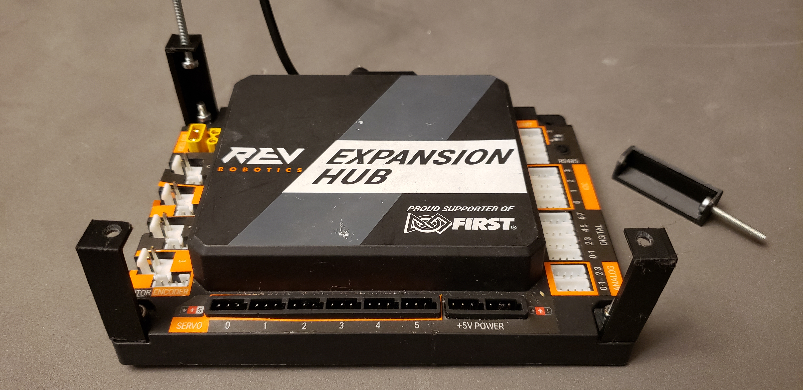

# 3D Printed Parts for our Robot

## Hub Legs
Since we needed to place our expansion hubs right on top of each other to use our space effectively we decided to 3D print hub legs that connected the hubs together and connected the hubs to our base. These legs were an easy way to connect the base to the hubs and it makes it easy to remove the hubs quickly

This is an image of the legs we made to attach the hubs together.

## Phone Case
We decided that we needed an proper place to keep our robot controller on the robot and so we designed a 3D printed case that we could screw onto our robot. Currently we aren't using the case because we don't a good place to put it on our robot.
We also have a phone case for our Driver Station. This phone case is slightly different from the Robot Controller Case because now we have another whole so that a lanyard can be attached so it can be attached to one of the drivers necks.

Here is an image of our driver station phone case.

## Team Tracker

In the very beginning we were planning to cut a yellow block in half and use it as our team tracker. Instead of doing that we decided to 3D print a block that was 4x4x4, or half a block minus the stackable things. While making our block we extruded an R( for Robotrons ) and our team number. Then one of our team members painted the tracker with red, blue, and our team color, purple.

Here is an image of our team tracker

