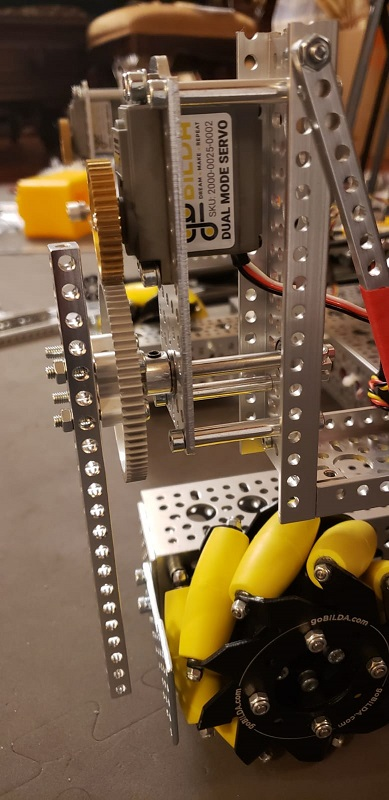
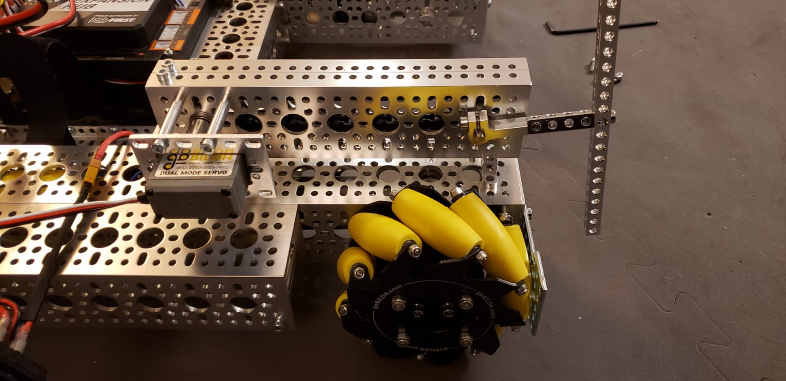
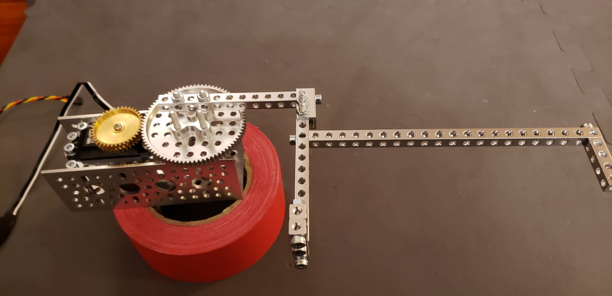
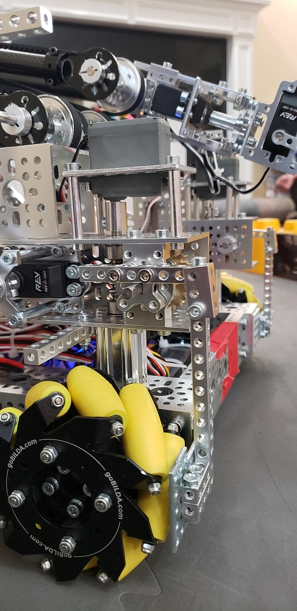

# First Base Puller Design #

We started out by which with a design that allowed us the pull the base without putting a lot of pressure on the motor. To do that, we attached a bar to the servo motor which rotated horizontally. All the pressure would be on the bar, not the servo motor. We tested it but then found it exceeded the sizing  limits. We tried pushing the part back a little bit but the bar needed to be a certain distance away from the base. When we moved it back, there wasn't enough space.

# Second Base Puller Design #

To fix the first problem, we replaced the part with a servo motor turning a chain which turned the bar which gripped the base. We tested the design but found out that the servo motor had too much tension on it. This didn't allow the bar to be locked in place when we pulled back. 

# Third Base Puller Design #

To fix the second problem we replaced the second part we made with a similar design to the first one. We arranged the servo motor in the same way but placed it on our robot so it extends in the front. We were able to push a few blocks but when we went to pull the base, the bar unlocked and we weren't able to pull. The bar came unlocked because of tension. 

# Fourth and Final Base Puller Design #

To fix the third problem, we replaced the part with a part that used worm gears.  The servo motor would turn the worm gear which turned the bar. The worm gears had a 1 to 24 gear ratio which caused it to go slow but it was the best we could get. Everything else had a higher gear ratio. To fix this, instead of starting with the bar far up, we start with the bar as far down as possible. This allows to get to the position we need faster. The servo motor doesn't have tension anymore so we can lock onto to the foundation allowing us to pull the foundation back without any issues. 