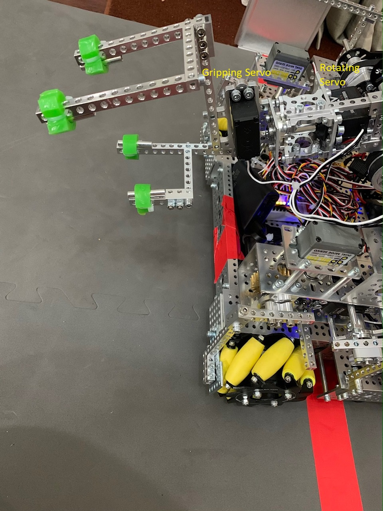

#Grip

We have a gripping mechanism at the end of our stackable arm. It has two servos connected to it so it can rotate, making it easier to grab the block and a servo that allows the gripper to grip the block and release the block once stacked. We have cut up rubber wheels to make sure our gripper doesn't slip.

Here is an picture of our Grip mechanism
