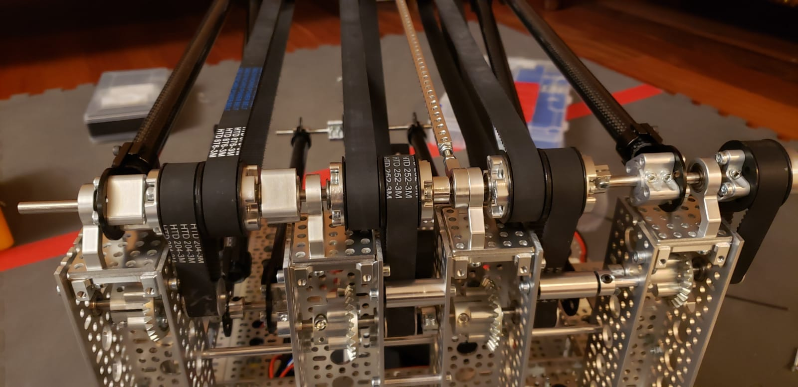

bevel gear 
30 rpm
1:2 ratio

The arm uses 4 30 rpm DC motors connected to the base and 2 servo motors at the claw. The motors are vertical and feed into bevel gears that have a 1:2 ratio. These gears are connected to wheels that are connected by a long axel spanning the width of the system. The wheels are connected to belts that stretch to wheels on an opposite axel. The axels are connected by carbon fiber rods. These allow stability while being light weight. The second axel connects with more belts and rods to make a third section. The last section of the arm is the claw. The claw has a wrist that can rotate the claw. This is powered by a servo motor. The 3 beams on the end can squeeze together to pick up a block. This is also powered by another servo motor.
 
This is a picture of the first version of the Arm Joint1

When we running the program, we found that the belts were slipping. They were slipping because the arm was too heavy. It also didn't under the alliance specific bridge. We weren't able to move it down because the motors would hit the wheels. To fix this, we got new gears that were smaller and reduced the length of each joint. This allowed the motors to be closer together. This allowed us to move the arm down and fit between the wheels.

