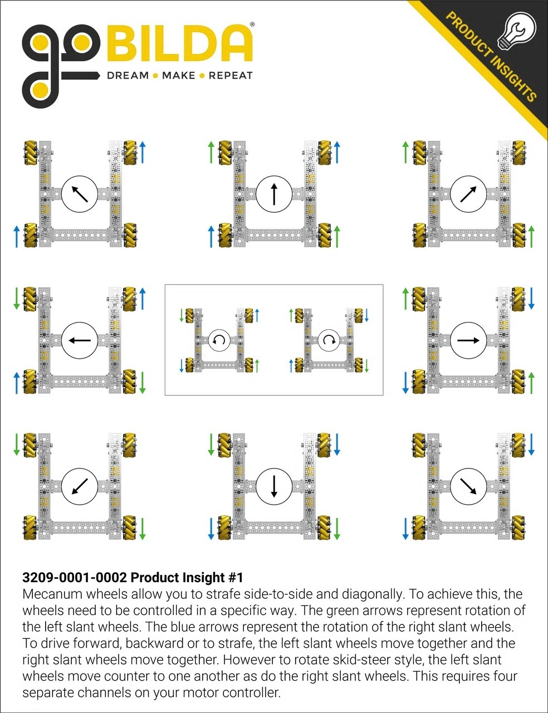

# Objectives #
Our team wanted a base that was low to the ground so we could have more attachments. We also wanted it to be sturdy and have four motors, one for each wheel, but still take up less space. Our last objective was to be able to use mecanum wheels on our base. 

# Using Mecanum Wheels #
We wanted to use mecanum wheels because we could move in all directions without turning the robot every single time we wanted to move which would take up a lot of time and effort if we were to use regular wheels. To solve this problem, we found a base that had enough room to add on mecanum wheels. Now, when we want to change direction, all we need to do is click a button and it will move at that direction.

# Our custom modifications #
As we were looking for a base that would fit all almost all our requirements, we found a base called the Strafer Chassis Kit on the Gobilda website. This base model took up less space, was low to the ground and provided room to atatch mecanum wheels on the sides with one motor per wheel while still taking up very less space. However, our team wanted to place both of our hubs without taking up any additional space. To do this, we changed our base design a little bit. ADD AN IMAGE HERE FOR THE BASE. To acomplish this, we moved the back bar further back. We also turned it and the bar that is in front of it so that the hubs can sit on top of each other with the battery pack next to it. This allowed us to add more attachments which was really useful to score more points in both teleop and autonomous periods. 