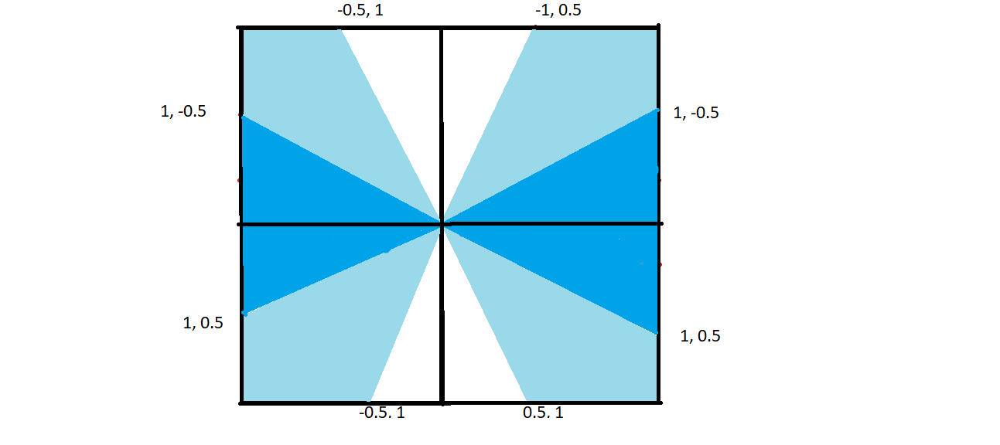

# Tele-Ops Programming

## Previous
When we made our first teleops program we couldn't figure out how to program with the joysticks. Instead we used the d-pad, the abxy buttons and the bumpers. We then attempted to use joysticks but could only make the robot go forward or backward. This program would get the job done but the robot had one set speed it could go and we couldn't make the robot go slow

## Now
Afterwards we realized that if we divided our joystick into sections and used math to establish lines, we could make each command have a specific section on our joystick. Using this we were able to make one joystick make the robot go front , back, left, and right, and the other joystick, to move the robot diagonally. We used the triggers to slide left and right. This program was way better than our first program because a) most people are more accustomed to using the joysticks compared to the d-pad and b) now we could make robot go at different speed. The farther to the extremes of the joystick the faster, and the closer in the slower.

This picture shows how we divided up our joystick. The white sections show going forward and backward, and the darker blue sections show going turning left and right on the left joystick. This picture can also describe the right joystick. The light blue sections show the space for each diagonal. The light blue space in the top left is for moving diagonally left forward for example. The regions for each diagonal are small so that there is a gap between the diagonals. This ensures that we don't by accident move in the wrong direction.