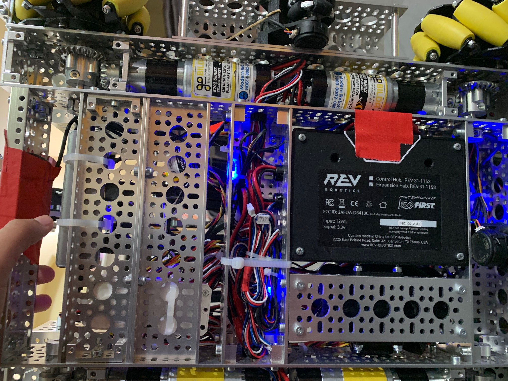

#Wire Management

Last year, our wires were very very messy and it was hard to replace or add new wires to our hub. This year we made sure to use zip tie to hold wires together. We also used labels on our wires and wrote the names of each component. This makes it easier when we have to rewire our robot.

